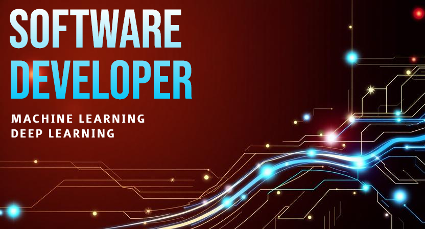

    <picture>
        
    </picture>

## About me

Hello and welcome to my profile!

I am Yasi, currently training to become a software developer.

I am passionate about anything that involves science and technology. Lately I am mainly focused on Machine Learning and Deep Learning. I find these topics fascinating and I am fully invested in increasing my knowledge in these fields.

Over the past few years I have traveled a lot, lived and worked in many different cities and even in different countries. Therefore, I have become proficient in several languages (English, Spanish, French).

I am a former O&M Technician in the world of renewable energies where I used to work in industrial photovoltaic power plants. The main objective of this line of work can be summarized as ensuring optimal performance of these power plants. One of my main duties involved training new technicians that had no previous experience in the field. Having witnessed their progression and in some sense having contributed to it has been a very enriching experience. I am proud of their evolution as they have become really solid professionals.

Leaving aside the world of electricity and power generation, I have taken the decision to focus my time on the world of software development.

So this is a very brief peek at my professional past as well as my current focus, as for what my future holds, nothing is really settled. I am always open to any opportunities that may arise.

Thanks for taking the time to read this, and I wish you a wonderful day!

## Tech stack

- C
- Python
- HTML5
- CSS
- JavaScript
- SQL (MySql; SQLite; SQLAlchemy)
